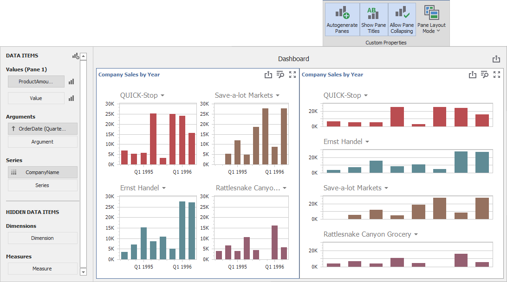

_files to look at:_

* [Form1.cs](./CS/DesignerSample/Form1.cs) (VB: [Form1.vb](./VB/DesignerSample/Form1.vb))
* [MultiPaneExtension.cs](./CS/MultiPaneExtension/MultiPaneModule.cs) (VB: [MultiPaneExtension.vb](./VB/MultiPaneExtension/MultiPaneModule.vb))

# How to Display Each Series in a Separate Pane for Chart Dashboard Items  
This example creates a WinForms Dashboard extension module that allows users to display each series in a separate pane for Chart Dashboard Items.



## MultiPane Extension  
This extension adds four new options to the Dashboard Designer's Ribbon toolbar: 
 - The **Autogenerate Panes** option generates a separate pane for each series;
 - The **Show Pane Titles** option displays titles at the top of each pane. This option only applies to panes generated by this extension.
 - The **Allow Pane Collapsing** option collapses and expands panes generated by this extension at run-time.
 - The **Pane Layout Mode** option determines the layout of panes within the Chart Dashboard Item. 
 
These custom settings are stored in the dashboard definition and can be saved and restored as a part of a dashboard file. You can use Dashboard exporting capabilities to print/export Chart Items with panes generated by this extension.

## How to Integrate the MultiPane  Extension Module  
Follow the steps below to reuse the module in other Dashboard Designer/Viewer applications:

* Add the MultiPaneExtension project to your solution
* Add a reference to this project to References in your project with dashboard controls
* Call the following code to create the extension and attach it to the Viewer or Designer control:

**C# code**:
```csharp
MultiPaneModule extension = new MultiPaneModule();
extension.Attach(*Dashboard Control instance*);
```

**VB code**: 
```vb
Dim extension As New MultiPaneModule()
extension.Attach(*Dashboard Control instance*)
```
   
## Example Structure  
The **MultiPaneModule** class contains the main logic of the extension and includes the following logical sections: 

* Assigning Logic

   The **Attach** and **Detach** methods in this section subscribe and unsubscribe events used for customization in this extension.

* Common Logic

    This section contains event handlers and methods for the Designer and Viewer controls.

* Designer Logic

    This section contains the logic for the Dashboard Designer UI. It includes methods that add new ribbon toolbar items, their click handlers, and the method that updates their states based on the selected dashboard item.

The **MultiPaneSettings** class describes the model of custom settings used in this extension. The extension stores this model in a Custom Property of each Chart Item and reads this data when required. The class has the **FromJson** and **ToJson** public static methods which saves and reads data in JSON format because custom properties allow you to store data only in the string format. 
  

## Documentation  
* [Custom Properties](https://docs.devexpress.com/Dashboard/401595/winforms-designer/custom-properties)
* [Access to Underlying Controls](https://docs.devexpress.com/Dashboard/401095/winforms-designer/access-to-underlying-controls)
* [ChartControl Panes](https://docs.devexpress.com/WindowsForms/5879/controls-and-libraries/chart-control/chart-elements/diagram/panes)
